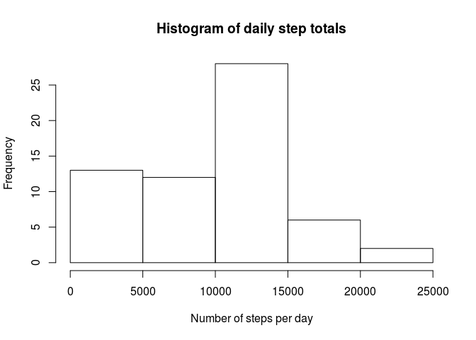
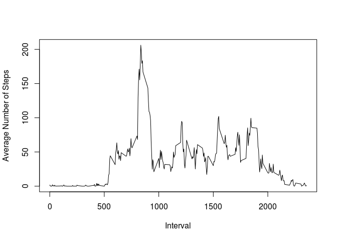
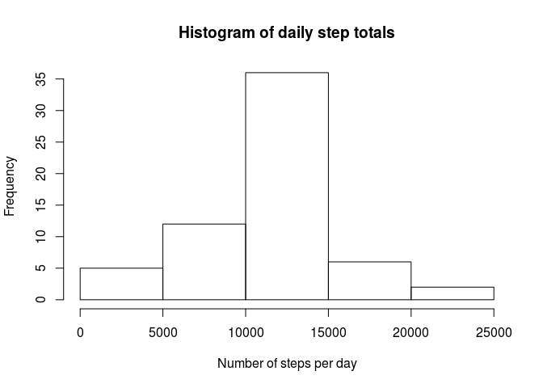
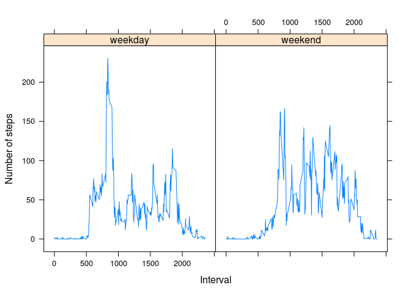

# Reproducible Research: Peer Assessment 1


## Loading and preprocessing the data.


```r
theData <- read.csv("activity.csv", header=TRUE, na.strings="NA")
theData[,2] <- as.Date(theData[,2])
```

## What is mean total number of steps taken per day?


```r
listOfDates <- unique(theData[,2])
stepData <- c()

for(i in listOfDates){
        dataForTheDay <- subset(theData, date==i)
        stepsForTheDay <- sum(dataForTheDay[,1], na.rm=TRUE)
        stepData <- c(stepData, stepsForTheDay)
}

hist(stepData, main = "Histogram of daily step totals",  xlab = "Number of steps per day")
```

 


```r
theMean <- mean(stepData)
theMedian <- median(stepData)
```

The mean is 9354.2295082 and the median is 10395.

## What is the average daily activity pattern?


```r
intervalData <- data.frame(interval = numeric(0), average = numeric(0))
theIntervals <- unique(theData[,3])
for(i in theIntervals){
        dataForTheInterval <- subset(theData, interval==i)
        intervalData <- rbind(intervalData, c(i, mean(dataForTheInterval[,1], na.rm=TRUE)))
}

plot(intervalData$X0, intervalData$X1, type="l", xlab="Interval", ylab="Average Number of Steps")
```

 


```r
theMax <- intervalData$X0[which.max(intervalData$X1)]
```

Interval 835, on average across all the days in the dataset, contains the maximum number of steps.

The average daily pattern has an abrupt increase in activity around interval 500, peaking around interval 835, and then tapering off from around interval 1800 onwards.

## Inputing missing values


```r
sum(is.na(theData$steps))
```

```
## [1] 2304
```

```r
sum(is.na(theData$date))
```

```
## [1] 0
```

```r
sum(is.na(theData$interval))
```

```
## [1] 0
```

From the calculations above we see that only the step column has missing values. There are 2304 observations with such missing values.


The strategy we will use for filling in missing values is to use the mean over an interval.


```r
theModifiedData <- theData
for(i in seq(length(theModifiedData$steps))){
        if(is.na(theModifiedData[i,][1])){
                lookupValue <- theModifiedData[i,][3]
                lookupValue <- as.numeric(lookupValue)
                value <- subset(intervalData, intervalData$X0==lookupValue)[2]
                theModifiedData[i,][1] <- subset(intervalData, intervalData$X0==lookupValue)[2]
        }
}
```


```r
modifiedStepData <- c()
for(i in listOfDates){
        dataForTheDay <- subset(theModifiedData, date==i)
        stepsForTheDay <- sum(dataForTheDay[,1])
        modifiedStepData <- c(modifiedStepData, stepsForTheDay)
}

hist(modifiedStepData, main = "Histogram of daily step totals",  xlab = "Number of steps per day")
```

 


```r
modifiedMean <- mean(modifiedStepData)
modifiedMedian <- median(modifiedStepData)
```

With missing values filled in, the mean becomes 1.0766189\times 10^{4} and the median becomes 1.0766189\times 10^{4}. These values differ from the estimates from the first part of the assignment. Inputing missing data results in a more realistic histogram for intervals corresponding to the early morning, where we do not anticipate many steps.


## Are there differences in activity patterns between weekdays and weekends?


```r
library(lattice)

theModifiedData$date <- weekdays(theModifiedData$date)
weekdayData <- subset(theModifiedData, !(date == "Saturday" | date == "Sunday"))
weekendData <- subset(theModifiedData, date == "Saturday" | date == "Sunday")


weekdayIntervalData <- data.frame(interval = numeric(0), average = numeric(0))
theIntervals <- unique(weekdayData[,3])
for(i in theIntervals){
        dataForTheInterval <- subset(weekdayData, interval==i)
        weekdayIntervalData <- rbind(weekdayIntervalData, c(i, mean(dataForTheInterval[,1])))
}

weekendIntervalData <- data.frame(interval = numeric(0), average = numeric(0))
theIntervals <- unique(weekendData[,3])
for(i in theIntervals){
        dataForTheInterval <- subset(weekendData, interval==i)
        weekendIntervalData <- rbind(weekendIntervalData, c(i, mean(dataForTheInterval[,1])))
}

l <- length(weekdayIntervalData$X0)
weekdayIntervalData <- cbind(weekdayIntervalData, rep("weekday", l))

l <- length(weekendIntervalData$X0)
weekendIntervalData <- cbind(weekendIntervalData, rep("weekend", l))

colnames(weekdayIntervalData) <- c("interval", "mean", "day")
colnames(weekendIntervalData) <- c("interval", "mean", "day")
allIntervalData <- rbind(weekdayIntervalData, weekendIntervalData)

xyplot(mean~interval | day, data=allIntervalData, xlab="Interval", ylab="Number of steps",layout=c(2,1),typ="l")
```

 

There are differences in activity patterns between weekdays and weekends. During weekdays there is greater activity between intervals 500 and 1000. During weekdays activity starts abruptly around interval 500, in contrast to weekends where activity ramps up slowly. On weekends activity lasts longer into the evening.
